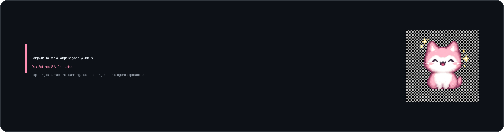

<!-- HEADER -->

  

 

<!-- ABOUT ME -->
## About Me

Hi! I am a Data Science and Artificial Intelligence enthusiast who is passionate about turning data into meaningful insights. I enjoy building intelligent applications and exploring the intersection of data, technology, and creativity.

I am currently learning Data Analysis, Machine Learning, Deep Learning, and AI Applications — with a strong interest in using these to build projects that are both useful and impactful.

---

<!-- TECH STACK -->
## Tech Stack

**Languages & Web**

  

**Data Science & AI**

  
  
  
  
  

  
  
  

**Tools & Database**

  

---

<!-- GITHUB STATISTICS -->
## GitHub Statistics

  <picture>
    <source
      media="(prefers-color-scheme: dark)"
      srcset="https://github-readme-stats.vercel.app/api?username=Ctiaqis&show_icons=true&hide_border=true&theme=dark&bg_color=00000000"
    >
    
  </picture>
  <picture>
    <source
      media="(prefers-color-scheme: dark)"
      srcset="https://github-readme-stats.vercel.app/api/top-langs/?username=Ctiaqis&layout=compact&hide_border=true&theme=dark&bg_color=00000000"
    >
    
  </picture>

---

<!-- CONNECT WITH ME -->
## Connect With Me

  

  <!--
  [TODO] LinkedIn: Hapus komentar di bawah ini dan ganti URL_LINKEDIN dengan link profil LinkedIn Anda.

  
  -->

  <!--
  [TODO] Email: Hapus komentar di bawah ini dan ganti EMAIL_ANDA@domain.com dengan email Anda.

  
  -->

---

<!-- FOOTER -->

  Learning, building, and growing through every project.

